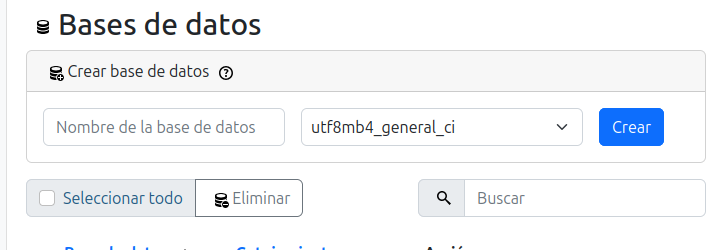
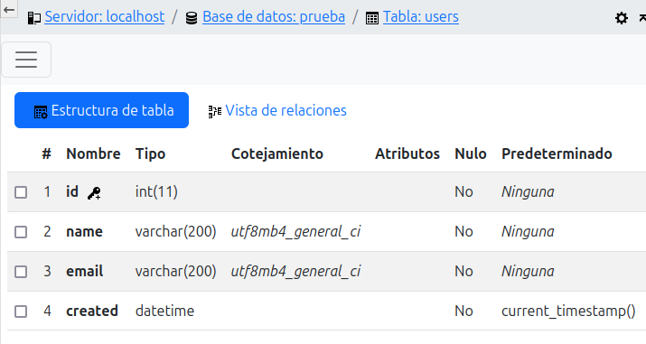
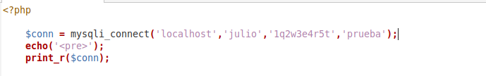

# Crear base de datos, crear tablas, conexión a la base de datos        

## Crear la base de datos       
1. Entramos en phpMyAdmin y le damos a nuevo
2. Le ponemos un nombre (prueba) a la base de datos y le damos a crear

## Crear tablas
1. Una vez creado nos metemos y creamos una table users con su id, name,email y created

## Conexión de la base de datos     
1. Creamos un archivo php y ponemos lo siguiente para hacer la conexión a la base de datos
