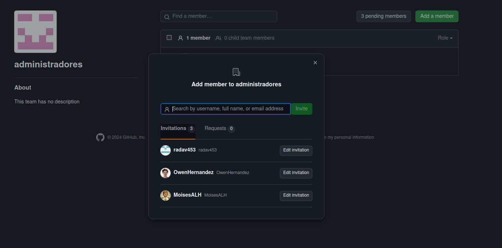

# DPL_A_Julio

## CREAR UNA RAMA v0.2
Se crea una rama y se va a esta con ```git checkout -b v0.2```


## AÑADIR EL FICHERO 2.txt
Se añade el archivo 2.txt en la rama v0.2

## CREAR UNA RAMA REMOTA v0.2
Se pushea al repositorio remoto con ```git push --set-upstream origin v0.2```


## MERGE DIRECTO
Se cambia a la rama origin con ```git checkout main```


Se hace un merge con v0.2 con ```git merge v0.2```

## MERGE CON CONFLICTO
Se pone hola en el fichero 1.txt y se hace commit, despues nos posicionamos en v0.2 y pnemos adios en 1.txt y se hace commit otra vez. Al hacer eso se crea un conflicto y al intentar mergear no funciona

		


## LISTADO DE RAMAS
Se lista las ramas con merge y sin merge con ```git log --all --decorate --oneline --graph```


## ARREGLAR CONFLICTO
Se arregla el conflicto metiendose en el archivo en si y eligiendo que es lo que te quieres quedar, en este caso nos quedamos con Adios, borras lo demás ya que estos son los indicativos de a que rama pertence cada cosa.

		


## BORRAR RAMA
Se borra la rama con ```git branch -D v0.2```


## LISTADO DE CAMBIOS
Se lista las ramas con ```git log --all --decorate --oneline --graph```


## CREAR UNA ORGANIZACIÓN
Se crea la organización en github poniendo nuestro nombre


## CREAR EQUIPOS
Se crean los dos equipos administrador y colaboradores y se añade a la gente



