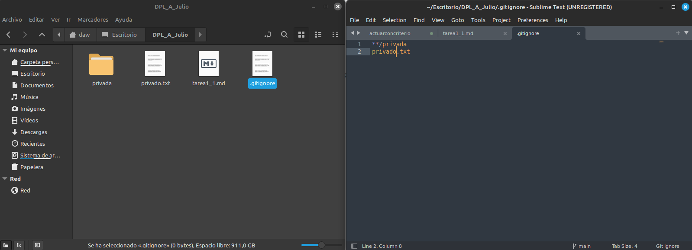

# DPL_A_Julio

## Creación del archivo README		 
1. Se crea tarea1_1.md

## Commit inicial		
2. Se hace ```git add .```
3. Se hace ```git commit -m "commit inicial"```

## Push inicial		
4. Se hace ```git push```

## Ignorar archivos		
5. Se crea privada.txt
6. Se crea la carpeta privada
7. Se crea el gitignore poniendo dentro las rutas de estos dos archivos



## Añadir fichero 1.txt
8. Se crea el archivo 1.txt

## Crear el tag v0.1
9. Se crea el tag v0.1 con ```git tag v0.1```

## Subir el tag v0.1
10. Se hace el comando ```git push origin --tags```

## Configuración y uso social de Github
11. Ya tenia una foto de perfil
12. Se puso el autentificador de dos pasos
13. Se sigue al resto de compañeros
14. Se pone estrellas en los repositorios de los demas

## Crear una tabla
| Nombre | Github  |
|Moises|https://github.com/MoisesALH|
|Owen|https://github.com/OwenHernandez|
|Angel|https://github.com/Angel-L-G|